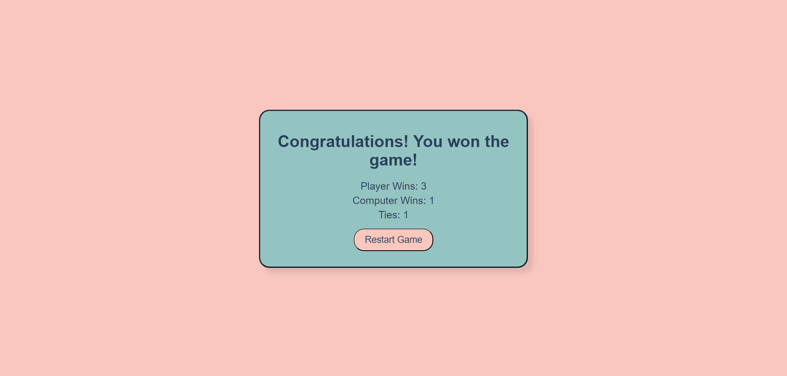

# Rock Paper Scissors Lizard Spock Game

Rock Paper Scissors Lizard Spock Game is a fun game where you play against the computer to win or lose the game.

The game's focus is like the game that we have all played growing up, but with the twist of adding lizard and spock and playing against the computer. 

[View Rock Paper Scissors Lizard Spock Game live project here]
- - -
## Table of Contents

### [User Experience (UX)](#user-experience-ux-1)
* [User Stories](#user-stories)
### [Design](#design-1)
### [Features](#features-1)
* [Existing Features](#existing-features)
### [Features Left to Implement](#features-left-to-implement-1)
### [Technologies Used](#technologies-used-1)
### [Frameworks, Libraries & Programs Used](#frameworks-libraries--programs-used-1)
### [Testing](#testing-1)
* [Validation Results](#validation-results)
* [JSHint Results](#jshint-results)
* [Manual Testing](#manual-testing)
* [Fixed Bugs](#fixed-bugs)
* [Lighthouse Report](#lighthouse-report)
### [Deployment](#deployment-1)
* [GitHub Pages](#github-pages)
### [Credits](#credits-1)
* [Code](#code)
* [Content](#content)
### [Acknowledgements](#acknowledgements-1)
---
## User Experience (UX)

Rock Paper Scissors Lizard Spock game provides an enjoyable experience that challenges its users. With its easy-to-use interface, this game is sure to keep users engaged!

### User Stories

* First-time visitor goals
    * Understand the main purpose of the website, a fun interactive game.
    * Reading the rules to understand the game.
    * Playing the Game
    * Enjoying the overall experience.

* Returning visitor goals
    * Win against the computer.
    * Continuing to enjoy the overall experience.

---
## Design

 * Colour Scheme
    * Primary colors used on the website: 

 * Typography
    * Arial font is the main font used throughout the website with san-serif as its fallback font.

 * Wireframes
    * Pen and paper in the notebook.

## Features

* The main objective of this website is to provide and exciting platform for users to enjoy and destress from everyday life. 
* Responsive design that is optimized for different devices, such as desktop computers, tablets, and smartphones.

### Existing Features

  * The heading is displayed at the top of the page, ensuring that people using the game can identify the game. Upon visiting the website, the user's attention will be immediately drawn to the game's name, which is displayed in a clear and visible manner.
    

* Game landing page
    * Heading
    * Start game button which takes you directly into the game page.
    * Rule button with detailed game instructions.

* Rule Page 
    * Rules modal page is a pop-up page when you click on the rules button

* Game interface
    * Buttons for game choices.
    * Score counter.

* Game Result
    * After the game has been played, the results page will pop up to let the user know whether they have won or lost to the computer. 
    * Score display: this feature shows the score that the user achieved against the computer. 
    * Restart Game button: This button allows users to play the game again.

## Features Left to Implement

* Add username feature to allow for the computer to know when users return. 
* Add more difficulty levels to it. 
* Include a timer feature to the game to add urgency to the player.  

---

---

## Technologies Used

* [HTML5](https://en.wikipedia.org/wiki/HTML5)
* [CSS3](https://en.wikipedia.org/wiki/CSS)
* [JavaScript](https://en.wikipedia.org/wiki/JavaScript)
* To handle data in my JavaScript code, I used [JSON](https://en.wikipedia.org/wiki/JSON) as a data format.

---

## Frameworks, Libraries & Programs Used

* [Gitpod](https://www.gitpod.io/)
    * To write the code.
* [Github](https://github.com/)
    * Deployment of the website and storing the files online.
* [Am I Responsive](https://ui.dev/amiresponsive)
    * Mockup picture for the README file.

---

## Testing

The W3C Markup Validator, W3C CSS Validator and JSHint, a JavaScript Code Quality Tool were used to validate every html, css, and js file to ensure there were no errors.

* [W3C Markup Validator](https://validator.w3.org/)
* [W3C CSS Validator](https://jigsaw.w3.org/css-validator/)
* [JSHint](https://jshint.com/)

### Validation results

HTML files, no errors were returned when passing through W3C Markup Validator.

CSS file, No errors were found when passing through the official W3C CSS Validator. 

### JSHint results

index.js, No errors were found when passing through the official Jshint validator.

### Manual Testing 

* The website was tested on Google Chrome, Microsoft Edge, and Opera browsers.
* The website was viewed on a desktop computer, laptop, tablet, and a mobile phones, such as Iphone 12 pro.
* A large amount of testing was done to ensure links between pages are working correctly on all pages.
* Family and friends were asked to review the website for a better understanding of the user experience.
* Family and friends were asked to play the game and give feedback.
* Dev Tools was used to test how the site looks on various screen sizes.

### Fixed Bugs

* Bug appeared that dropped the restart page. this was fixed by commenting out code until the restart game page returned. 
* Bug was fixed with as css style sheet was not linked correctly.

### Lighthouse Report

#### Mobile analysis

Performance

#### Desktop analysis

Performance

## Deployment

### GitHub Pages

GitHub Pages used to deploy live version of the website.
1. Log in to GitHub and locate [GitHub Repository capital-cities](https://github.com/Thomas-Tomo/capital-cities)
2. At the top of the Repository(not the main navigation) locate "Settings" button on the menu.
3. Scroll down the Settings page until you locate "GitHub Pages".
4. Under "Source", click the dropdown menu "None" and select "Main" and click "Save".
5. The page will automatically refresh.
6. Scroll back to locate the now-published site [link](https://thomas-tomo.github.io/capital-cities/) in the "GitHub Pages" section.

## Credits

### Code

 * The README template was helpfully provided by [Code Institute (template)](https://github.com/Code-Institute-Solutions/readme-love-maths/blob/master/README.md
   * Content was written by the developer with the help of google searches whenever there wa an issue.
  * Some content was copied from walkthrough project and from code that I have learnt from the course. 
 
 ### Content

  * Content was written by the developer with the help of google searches tp understand the extra additions to the traditional rock paper scissors game.  

---

## Acknowledgements

 * My mentor Mitko Bachvarov provided helpful feedback.
 * Slack community for encouragement.